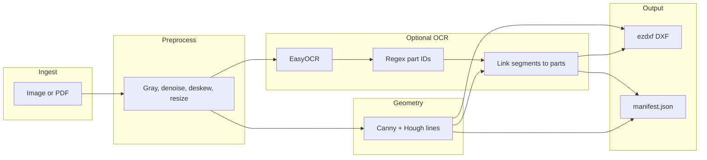
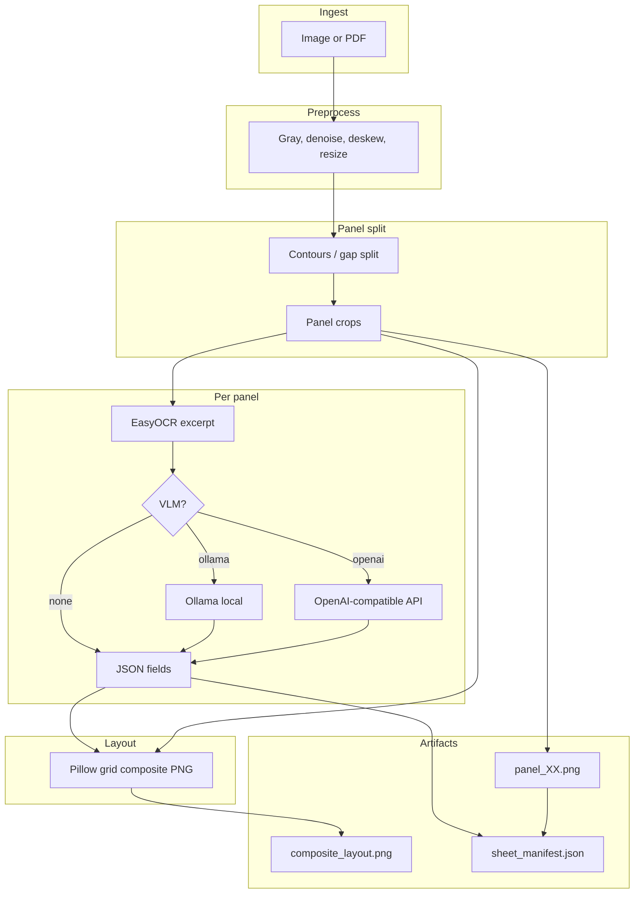
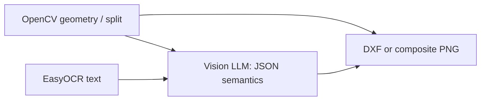

# Drawing-to-DXF workflow diagrams

Mermaid source for the DXF pipeline, shop-sheet pipeline, and AI layer.  
View in GitHub, VS Code/Cursor (Markdown preview), or [mermaid.live](https://mermaid.live).

---

## A. DXF pipeline (`drawing-to-dxf …` without `sheet`)

---

## B. Shop sheet pipeline (`drawing-to-dxf sheet …`)

---

## C. Where AI sits (semantic layer — not image generation)

